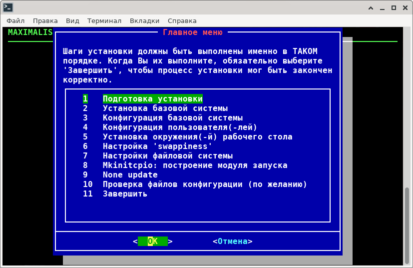

# aif-master

---

* [Russian Text](#Russian)
* [English Text](#English)

<a name="Russian"></a>

aif-master - Bash скрипт для установки системы Archlinux на компьютер.



<a name="Oglavlenie"></a>

## Оглавление

1. [Информация](#Information)
2. [Использование](#Uses)
3. [Обо Мне](#about)


## <a name="Information">1. Информация</a>

Данный скрипт предназначен для установки системы **Archlinux** в псевдографическом режиме, 
с помощью утилиты **dialog**.

Скрипт можно использовать с абсолютно любым дистрибутивом *Archlunux*, кроме **bootstrap** и **arm** версии. 

Данный мастер поддерживает **UEFI** режим установки при запуске системы *ArchLinux* в режиме *UEFI*.

Данному установщику **не нужен** ни **XORG**, ни рабочее окружение ( **Desktop environment** ), ни дисплейный менеджер 
( **Display Manager** ). Данный скрипт работает полностью в консольном режиме. 

Для работы скрипта необходим следующий список пакетов:

* arch-install-scripts
* dialog
* ncurses
* lib32-ncurses
* parted
* util-linux
* gptfdisk
* pacman-contrib
* python (2 или 3)
* wget
* curl

Вы можете использовать данный мастер установки для самых разных режимов использования системы ArchLinux.

Например, не устанавливать графическую часть (XORG, Desktop Environment, Display Manager, драйвер видеокарты и другие), 
чтобы использовать в качестве сервера.

Или выбрать и установить только необходимые пакеты и использовать в качестве Настольного ПК.
Независимо от местоположения вашего компьютера - будь то офис или домашний ПК.

---

[К оглавлению](#Oglavlenie)

## <a name="Uses">2. Использование</a>

Для использования данного мастера необходимо соблюдать 2 важных условий:

1. Запуск из под суперпользователя **root**.
2. наличие настроенного подключения к интернету в вашем дистрибутиве
3. Установите в Live дистрибутив несколько зависимостей для корректной работы скрипта. Без указанных ниже утилит, скрипт просто не запустится.

$ sudo pacman -Syy ncurses bash dialog python --noconfirm

**Данный скрипт можно запустить из любого места**.
 
Достаточно сделать один из файлов - испольняемым и запустить его из консоли:

```
$ chmod ugo+x aif-installation/aif

$ sudo sh aif-installation/aif
```

Далее просто следуйсте указаниям мастер-установки.

**Желаем вам удачи**.

---

[К оглавлению](#Oglavlenie)

## <a name="about">3. Обо Мне</a>

Автор данной разработки **Shadow**: [maximalisimus](https://github.com/maximalisimus).

Имя автора: **maximalisimus**: [E-Mail](mailto:maximalis171091@yandex.ru).

Дата создания: **20.08.2019**

Начальная точка проекта: **Architect Linux installer**.

---

<a name="English"></a>

<a name="EngOglavlenie"></a>

aif-master - Bash script for installing the Archlinux system on a computer.


## Table of contents

1. [Information](#EngInformation)
2. [Uses](#EngUses)
3. [About](#Engabout)

## <a name="EngInformation">1. Information</a>

This script is intended for installing the **Archlinux** system in pseudographic mode, 
using the **dialog** utility.

The script can be used with absolutely any *Archlinux* distribution, except for 
**bootstrap** and **arm** versions.

This wizard supports **UEFI** installation mode when starting the *ArchLinux* system in *UEFI* mode.

This installer **does not need** either **XORG**, nor a working environment 
( **Desktop environment** ), nor a display manager ( **Display Manager** ). 
This script works completely in console mode. 

The following list of packages is required for the script to work:

* arch-install-scripts
* dialog
* ncurses
* lib32-ncurses
* parted
* util-linux
* gptfdisk
* pacman-contrib
* python (2 или 3)
* wget
* curl

You can use this installation wizard for a variety of modes of using the ArchLinux system.

For example, do not install the graphics part (XORG, Desktop Environment, Display Manager, graphics card driver, and others)
to use as a server.

Or choose and install only the necessary packages and use as a Desktop PC.
Regardless of the location of your computer - whether it's an office or a home PC.

---

[To the table of contents](#EngOglavlenie)

## <a name="EngUses">2. Uses</a>

To use this wizard, you must comply with 2 important conditions:

1. Start from under the superuser **root**.
2. the presence of a configured Internet connection in your distribution
3. Install several dependencies in the Live distribution for the script to work correctly. Without the utilities listed below, the script simply won't run.

$ sudo pacman -Syy ncurses bash dialog python --noconfirm

**This script can be run from anywhere**.

It is enough to make one of the files executable and run it from the console:

```
$ chmod ugo+x aif-installation/aif

$ sudo sh aif-installation/aif
```
Then just follow the instructions of the installation wizard.

**We wish you good luck**.

---

[To the table of contents](#EngOglavlenie)

## <a name="Engabout">3. About</a>

The author of this development **Shadow**: [maximalisimus](https://github.com/maximalisimus).

Author's name: **maximalisimus**: [E-Mail](mailto:maximalis171091@yandex.ru).

Date of creation: **20.08.2019**

Starting point of the project: **Architect Linux installer**.


